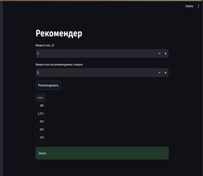

# Offline рекомендательная система, базирующаяся на двухэтапной модели:
1. этап: Конкатенированные кандидаты implicit KNN, popularity и GRU4Rec моделей
2. этап: Модель Catboost, которая переранжирует кандидатов первого этапа.
3. На выходе будет большая табличка с ранжированными кандидатами, по которым пользователю и будет даваться рекомендация.

## Рекомендательная система имеет:

 - trainer.py - скрипт для обучения моделей 
 - recommender.py - скрипт для получения рекомендаций по user_id
 - Streamlit app - интерфейс с возможностью рекомендации и просмотра данных(Hello.py + /pages)
 - Все таблицы и модели храняться в папке /data
 - Проект завернут в docker образ, который запускает рекомендер
 - Логирование clearML
 - Ну и как же без unittest в tests.py

 
## Как работают рекомендации:
### (Рекомендации не буду работать без финальной таблицы с кандидатам, до этого нужно запустить trainer.py и сделать их)
- Собрать контейнер: >  `docker build -t rec image` . 
- Запустить контейнер: > `docker run -i -t rec_images python recommend.py  {id_пользователя}`
### Данные для trainer.py можно получать как через clearML datasets, так и локально
- Streamlit приложение: > `streamlit run Hello.py`
- Тесты: > `py -m unittest` 

## Возможности trainer.py

## Пример работы recommender.py

## Streamlit приложение

  
